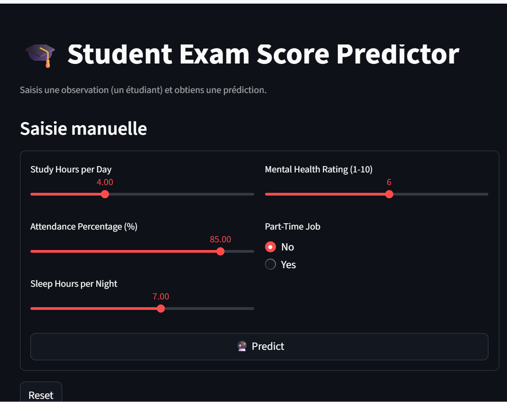
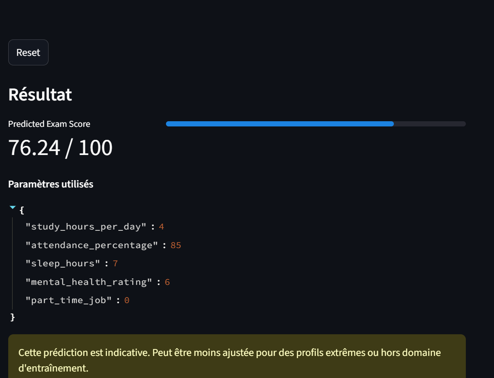
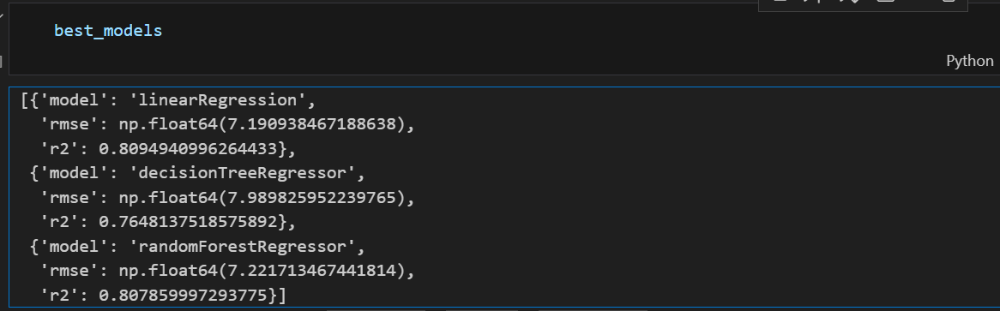
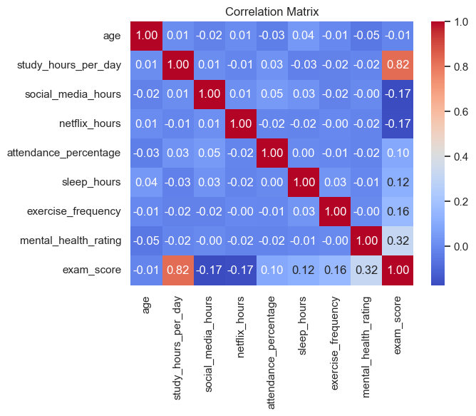
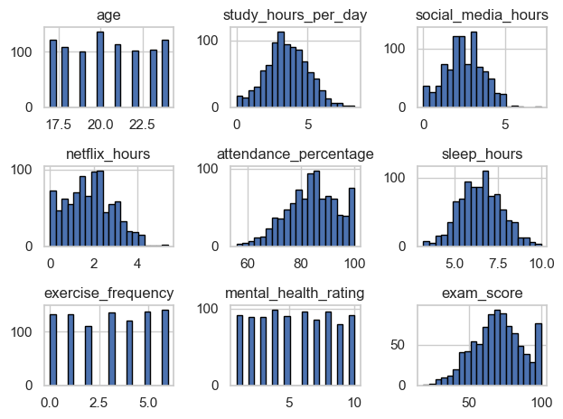
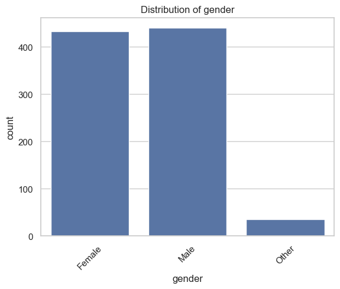
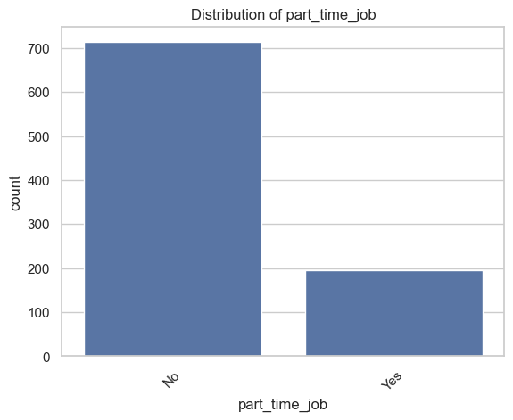
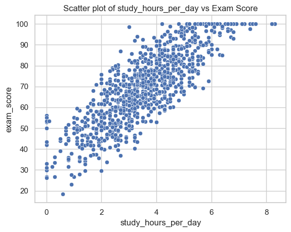

**DESCRIPTION**

**Student Exam Score Predictor** est une application de **Machine Learning** qui prédit le score d’examen d’un étudiant avec une **précision supérieure à 80 % (R² = 0.81, RMSE ≈ 7.19)**.
Le modèle estime la performance à partir des habitudes d’étude, du sommeil, de la présence et d’autres facteurs de vie.
**Objectif :** aider à se positionner, fixer des objectifs réalistes et adopter de meilleures pratiques. La méthodologie est également adaptable à d’autres contextes : **évaluation de la performance d’un salarié**, **suivi de projet**, etc.

**FONCTIONNALITÉS**

Exploration des données (EDA) dans Jupyter Notebook
Prétraitement et sélection des variables
Entraînement et comparaison de modèles : régression linéaire, arbre de décision, forêt aléatoire
Évaluation avec métriques (R², RMSE,)
Sauvegarde du meilleur modèle (joblib)
Application Streamlit pour une prédiction interactive

**PILE TECHNIQUE**

**Python, Pandas, NumPy, scikit-learn, Streamlit, Joblib, Jupyter Notebook**

**APERÇUS (SCREENSHOTS)**

**Formulaire Streamlit**
  
 
**Comparaison des modèles** 

**Analyse exploratoire des données (EDA)**
  
  
  
  
 

**STRUCTURE DU PROJET**

├── app/
│   └── app.py                # Application Streamlit
├── assets/                   # images/screens EDA & app
│   ├── app_screenshot.png    # Screens de l'application sur Streamlit
│   ├── eda_overview.png      # Screen de l'analyse exploratoire des données 
│   └── model_comparison.png  #Screen de la performance des models entrainés 
├── configs/
│   └── app.yaml              # Configuration du projet
├── data/
│   ├── raw/                  # Données brutes
│   └── processed/            # Données prétraitées
├── models/    
│    └── best_model.pkl        # Modèles sauvegardés
├── notebooks/
│   └── notebook.ipynb        # Notebook d’analyse et de modélisation
├── src/
│   ├── data/load.py          # Chargement des données
│   └── utils/config.py       # Gestion de la configuration
├── test/
│   ├──.gitignore
│   ├──README.md
│   └──requirements.txt          # Dépendances Python
└── 

**INSTALLATION**

1. Cloner le dépôt
git clone <url_du_repo>
cd student_exam_score_predict

2. Créer et activer un environnement virtuel
python -m venv .venv
.\.venv\Scripts\Activate.ps1  

3. Installer les dépendances
pip install -r requirements.txt
Choix du modèle

**UTILISATION**

1. Exploration et entraînement
Ouvrir notebooks/notebook.ipynb
Explorer les données et sauvegarder le modèle (best_model.pkl)

2. Lancer l’application
streamlit run app/app.py

3. Remplir le formulaire et obtenir une prédiction.

**REMARQUES**

*NaN et valeurs manquantes → ajout d’une étape d’imputation et validation dans <Streamlit.
*Bien que **Random Forest** semblait initialement performant, il prédisait des scores >irréalistes (≈60/100 même sans présence ni heures d’étude).
Après réentraînement et ajustements, la **Régression Linéaire** a obtenu les meilleurs résultats (R² = 0.81, RMSE ≈ 7.19) tout en restant cohérente avec la logique académique.
<Ce choix illustre l’importance de privilégier un modèle à la fois statistiquement robuste et pertinent métier.

